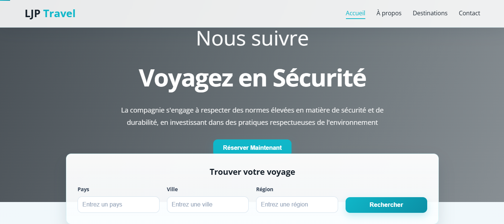
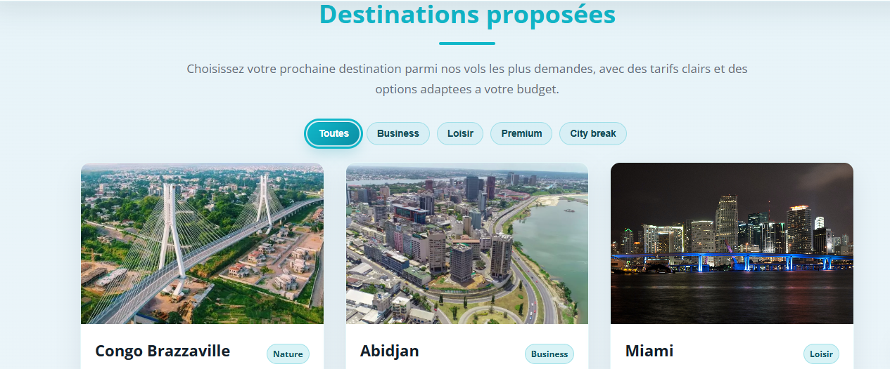

# LJP Travel - Site vitrine

Site vitrine de LJP Travel avec une UX modernisee : navigation fluide, formulaires plus clairs, section destinations plus vendeuse et identite visuelle renforcee.

## Apercu rapide

- **Objectif** : presenter la marque LJP Travel et faciliter la prise de contact/reservation.
- **Public cible** : voyageurs loisirs, professionnels et partenaires RH.
- **Points forts UX** : accessibilite, lisibilite, interactions fluides, design premium.

## Demo

- **Repo GitHub** : [Jacque004/ljpTravel](https://github.com/Jacque004/ljpTravel/)
- **Lancement local** : ouvrir `index.html` dans un navigateur (ou via serveur local XAMPP).

## Captures d'ecran

### Accueil / Hero

### Destinations proposees

> Place simplement les fichiers `a.png` et `c.png` dans `image/` pour que l'affichage fonctionne sur GitHub.

## Stack technique

- `HTML`
- `CSS`
- `JavaScript`

## Changelog UX (recent)

### Navigation et ergonomie

- Lien d'evitement clavier (`skip-link`).
- Menu mobile ameliore.
- Section active mise en avant pendant le scroll.
- Barre de progression de lecture.
- Bouton retour en haut.

### Accessibilite et interactions

- Cartes destinations utilisables au clavier.
- Focus visuel renforce.
- Fermeture des modales (clic exterieur + `Echap`).
- Notifications toast non intrusives.

### Formulaires

- Refonte visuelle des formulaires recherche/contact.
- Hierarchie labels/champs plus claire.
- Focus et feedback plus modernes.
- Compteur de caracteres sur le message contact.

### A propos

- Contenu restructure en **Mission / Vision / Valeurs**.
- Ajout de stats visuelles.
- Meilleure lisibilite et narration de marque.

### Destinations proposees

- Cartes enrichies (badge, duree, prix, CTA clair).
- Filtres visuels par type de destination.

### Design global

- Palette et composants harmonises.
- Boutons, cartes et ombres unifies.
- Amelioration de la coherence visuelle globale.

## Structure du projet

- `index.html` : structure de la page + scripts d'interaction.
- `style.css` : styles globaux, responsive et composants UX.
- `script.js` : scripts historiques.
- `image/` : assets visuels.
- `Docs/` : documents projet.

## Roadmap

- Tri combine destinations (prix, duree, popularite).
- Connexion formulaires a une API reelle.
- Ajout de tests front (smoke tests UI).

